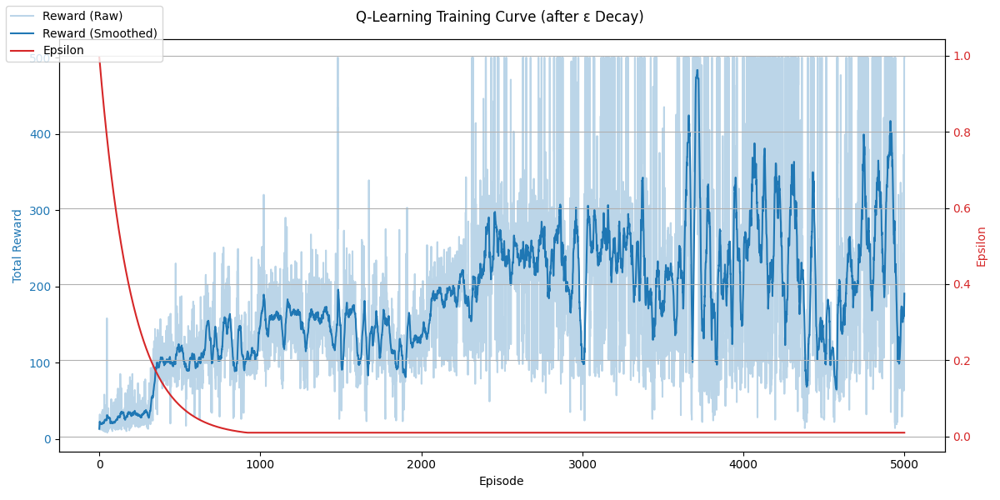

# LEARNED.md v0.5 — ε調整による Q-Learning 安定化の試み

## ⚙️ 今回の目的とアプローチ

前回のv0.4までで、Q-Learning の基本実装と ε-decay による学習促進を確認した。
今回は、**より安定的かつ高得点のエージェントを相手にすることを目指して**、以下のような調整を施した：

* 学習エピソード数を 5000 → **10000** に増加
* ε の減衰式を変更（指数関数型による滑らかな減衰）
* ε の推移と報酬の関係を **2軸グラフで可視化**

---

## ↺ ε 減衰ロジックの変更

前回までは以下のような「固定率で乗算」する形式を取っていた：

```python
agent.epsilon = max(agent.epsilon * 0.995, 0.01)
```

これに対して今回は、より滑らかな減衰を目指して指数関数型に変更した：

```python
agent.epsilon = MIN_EPSILON + (INITIAL_EPSILON - MIN_EPSILON) * np.exp(-DECAY_RATE * episode)
```

* `INITIAL_EPSILON = 1.0`
* `MIN_EPSILON = 0.01`
* `DECAY_RATE = 0.0005`

この式により、探索（exploration）から活用（exploitation）への移行がより自然になった。

---

## 📈 学習曲線の比較

### 🔹 Before Tuning (After ε Decay)

* 探索が早く終わりすぎたため、局所最適に陷りやすかった
* 後期の reward が不安定



---

### 🔸 After Tuning (Exponential ε Decay)

* ε を滑らかに減衰させたことで、後半でも探索が残り、**報酬が安定して上昇**
* 最大で500step に到達するエピソードも頻出
* だしまだ reward のばらつきは大きく、完全安定とは言い難い


---

## 💡 考察と次のステップ

### ✅ 得られた知見

* ε の調整は学習曲線に大きな影響を与える
* 緩やかな減衰によって、過度な早期反復を防げる

### 📌 今後の課題

* 状態空間の離散化が Q-table の表現力を制限している
* 報酬設計（reward shaping）や学習率 `alpha` の調整がさらなる改善につながる可能性
* 現状の手法では安定して500step 維持とは言い難い

---

## 🚀 今後の展望

* 報酬 shaping の導入（カートの中心への復元ボーナスなど）
* `alpha` の decay 導入
* 状態の離散化粒度の見直し
* そして、最終的には **DQN（Deep Q-Network）** への移行を視野に入れる

---

（v0.5 完）

</br>
</br>
</br>
</br>
</br>

# LEARNED.md v0.4 — Q-Learning 初期実装と ε-decay の影響

## 🌟 現状まとめ

Q-Learning の基本実装を `QLearningAgent` として立ち上げ，それを用いた CartPole の実験を開始。当初は ε を固定値のままで実行し，のちに ε-decay (探索率を減らす)を導入した。

まずは ε-decay なしの実験結果を次のように図示化：

---

## ⚙️ 実装に至るまでの試行錯誤と構築プロセス

今回の Q-Learning 実装は，単なるアルゴリズムの導入というより，**強化学習の「思考の流れ」を追体験するようなプロセス**だった。

* 初期段階では Q-Learning の理論から復習を開始し，「価値更新の式」や「状態空間の離散化」などのキーポイントを確認
* `QLearningAgent` はすでに存在していた `BaseAgent` を継承する形で自然に導入
* 離散化には `np.digitize` を使用し，連続空間を手軽に bin に分ける工夫
* 状態の離散表現は4次元 → `tuple` 化して辞書キーとして活用
* Q テーブルは二重の defaultdict によって簡潔に構築し，未知状態への対応もスムーズに
* 探索戦略として ε-greedy を実装。まずは固定 ε=0.1 で検証
* その後，学習が進むにつれて探索率を減衰させる `epsilon decay` をスクリプト側で実装（エージェントの責務からは切り離す設計）

特に印象的だったのは，**実装が完成し，初めて "学習の兆し" がグラフに現れた瞬間の喜び**である。

"あっ、これは確かに賢くなっている" という成長のカーブが，まさに Q-Learning の真価を物語っていた。

> うまくいくかどうかもわからない中で、理論・設計・実装・試行を繰り返し、ようやく自分の手で「学習するエージェント」を生み出せたことが非常に嬉しい。

この体験があったからこそ，次の改善（epsilon decay や reward shaping）にも前向きに進むことができる。

---

## 🧠 理論的考察と確認事項

今回の実装にあたり，以下のような理論的な議論・確認も行った：

* Q-Learning は **TD法（Temporal Difference）** の一種であり，

  * モンテカルロ法との違いは「エピソード終了まで待たずに学習する」こと
  * 実装では `Q[s][a] ← Q[s][a] + α * (r + γ * max Q[s'] - Q[s][a])` の形で反映

* 割引率 `γ` の役割は？

  * 将来報酬をどれほど重視するかのパラメータ（通常 0.99 など）
  * γ を高くすると「長期的な見返り」まで考慮するが，過大評価に注意も必要

* ε-greedy 戦略と探索・活用バランス

  * ε は「どれだけランダム行動を許すか」という探索率
  * 初期は探索が必要だが，後半は活用（greedy）が望ましい
  * よって ε を **固定にせず減衰させることが重要**

* 状態空間の離散化と `np.digitize` の意味

  * CartPole の状態は連続だが，Q-table 学習には離散化が必要
  * `np.digitize` は「区間のどこに含まれるか」で bin index を得る仕組み
  * 切り上げでも切り捨てでもなく，「境界リストに対する位置取得」

* Q-table の構造設計

  * 状態を tuple 化 → ネストした辞書構造
  * 例えば `Q[(2,1,3,0)][1]` のようにアクセス
  * 未知状態に備えて `defaultdict(lambda: [0.0] * num_actions)` を使用

このような議論を通して，ただ実装するだけでなく，**理論を足場とした手応えある開発**となった。

---

## 📊 Q-Learning の実験 (before ε-decay)


* 初期は弱いが一部ピークを見せる
* 重要なのは：定数のエピソード後も成長が見られる為、ε=0.1 でも探索は保持されている
* 倍数回実行することで，最終的に 500step 達成に至る

---

## 📊 ε-decay 導入後の実験 (after ε-decay)


* 第4000近辺で大きなブレイクスルー
* その後は 500step に達しないものの，確実に 20 近くまで成長
* 探索率の減少により，定義のような動作へ展開している

---

## ☑️ まとめ

* ε を固定した場合はゆっくりだが着定的に成長
* ε-decay を正しく設計することで，突然のブレイクスルーが見られる
* ただし decay が早すぎると exploration が止まり、成長が抜け落ちるので、今後は `epsilon` の decay rate や `alpha` の適度な減衰も検討する

</br>
</br>
</br>
</br>
</br>

# LEARNED.md v0.2 — Rule-based Control Completion and Toward Q-Learning

## 🧜‍♂️ 現在地：ルールベース制御の確立と可視化の完成

CartPole 環境における人間操作・ランダムエージェント・複数のルールベースエージェントによる比較を通じて、
強化学習以前の基礎的制御の検証と可視化が完了した。

---

## 📂 ディレクトリ構造と設計思想

```plaintext
rl-experiment/
├── agents/                 # 各種エージェント（rule-based, Q-learning など）
│   ├── base_agent.py
│   ├── rule_agent.py
│   └── q_learning_agent.py  # ※ 次フェーズで導入予定
├── scripts/                # 実行スクリプト（ログ収集・可視化・学習）
│   ├── run_cartpole_log.py
│   ├── plot_cartpole_log.py
│   └── train_cartpole_q.py  # ※ Q学習導入後に追加予定
├── logs/                   # ログ保存先（cartpole 環境用）
│   └── cartpole/
│       ├── human_play_log.json
│       ├── simple_log.json
│       ├── angle_only_log.json
│       └── predictive_log.json
├── LEARNED.md              # 学習ログと進捗記録
└── README.md               # プロジェクト概要
```

### 🌐 設計思想：拡張性と比較可能性の確保

* **エージェントはクラス単位で独立**し、共通の `select_action(obs)` インターフェースを実装。
* **スクリプトは処理単位（ログ出力・可視化・学習）で分離**し、目的ごとの簡易実行が可能。
* **ログは agent 単位に命名保存**し、再現・比較・可視化が容易。
* 今後 DQN や LunarLander 等に拡張しても構造が壊れず、**最低限の変更で多環境対応可能な設計**となっている。

---

## ✅ 実装・試行内容

### 1. 🌎 Human Play Logging

* Pygame を用いて左右キー操作でプレイ可能な CartPole UI を構築。
* `logs/cartpole/human_play_log.json` に 500 ステップまでのプレイログを保存。
* `plot_cartpole_log.py` の修正により任意のログファイルを可視化可能に。

### 2. 🤷 Rule-based Agent の追加と比較

* `AngleOnlyAgent`：obs\[2]（pole\_angle）の正負によって左右に操作。
* `SimpleRuleAgent`（当初）：`AngleOnlyAgent` と同等の制御であったため、差別化は保留。
* `PredictiveAngleAgent`：`angle + 0.5 * angle_velocity` に基づき予測的な制御を導入。

### 3. 📈 可視化基盤の進化

* `--log` 引数で任意のログファイルを指定可能に。
* 存在しないログファイルを指定した場合は候補一覧を表示。
* 続續報酬のプロットにより、各エージェントの成績を直感的に比較可能に。

### 4. ✨ 成果

* `PredictiveAngleAgent` によって CartPole を 500 ステップ維持（報酬満点）達成。
* 観測グラフ上でも角度の揺れが安定して抑えられており、簡単な予測モデルでも十分な効果を発揮することが示された。

---

## 🔄 次のステップ：Q-Learning の導入へ

* 離散化による状態表現と Q テーブルによる価値更新の実装へ移行予定。
* `BaseAgent` の設計が統一されているため、`QLearningAgent` の導入も自然に行える。
* 将来的には DQN を含むニューラル制御型との比較基盤にも拡張可能。
* その過程で、カート位置が中心に近いにつれボーナスを追加するような報酬設計の実験も検討中。
* 現在の Gym のデフォルト報酬 (1.0) に加算して
  `reward += α * (1.0 - abs(cart_position) / 2.4)`
  とするなどの実装を通じて、左右に振り切られるより「中心に戻ろうとする行動」を評価する方向へのシフトを目指す。

---

## 🔍 学習ログと今後の観察点

* 予測型ルールが環境に極めて強いことが判明 → Q 学習でこれを超えられるか？
* 学習曲線・探索率・状態空間の分割方法などの設計が、今後の性能に大きく関与する見通し。
* ルールベースの限界と、学習ベースの適応性との比較を無理なく観察を続ける。

---

（v0.2 完）


</br>
</br>
</br>
</br>
</br>

# LEARNED.md v0.1 — 強化学習入門：CartPole を題材にした可視化と分析

## 🧠 背景

Stack Tower ゲームを強化学習で制御するには、状態・行動・報酬が複雑すぎるため、まずは OpenAI Gym の CartPole 環境を用いたシンプルな強化学習の理解と分析に取り組むことにした。

---

## ✅ 段階的な取り組み

### 1. CartPole のランダムプレイログ収集

- `gymnasium.make("CartPole-v1")` を使用
- ランダムな行動で500ステップ程度プレイし、`obs`, `action`, `reward`, `done` を JSON に保存
- 出力形式は `json` と `csv` に切り替え可能な設計にしておき、分析に応じて使い分けられるようにした

### 2. 観測ログの可視化（plot_cartpole_log.py）

- 左グラフ：ポール角度 (`obs[2]`) の時間変化（赤線は `done=True` の瞬間）
- 右グラフ：報酬の推移を可視化（最初はステップごとの `reward`）

### 3. エピソードごとの累積報酬の算出

- `done=True` を区切りとし、各エピソードで `reward` を合計
- エピソード単位での報酬の伸び方・変動を分析できるようにした

### 4. ステップ単位での「エピソード内累積報酬」へ変更

- より直感的に「どこでゲームオーバーになったか」を確認できるように修正
- `done=True` のたびに累積報酬をリセットすることで、グラフ上で階段のようなパターンが見えるようになった

---

## 📊 分析のための工夫

- `Path(__file__).resolve().parent.parent` を使って、どこから実行してもログが読めるようにパスを統一
- `done=True` の位置に `axvline` で可視的な区切りを入れることで、エピソードの構造が見やすくなった
- JSON ログには `step` や `obs`, `reward` の全履歴が含まれており、後からあらゆる可視化に再利用できる

---

## 🎯 現時点での知見・気づき

- `done=True` のタイミングを意識すると、ポールがどれだけ揺れていると倒れるかがだんだん見えてくる
- エピソードの累積報酬のグラフは、**学習が進んでいるかどうか**の評価にも直感的に使える
- 今後、ルールベースや学習エージェントと比較する際にもこのログがベースになる
- 分析や可視化の柔軟性を保つためにも、ログ出力は汎用的にしておくべき

---

## 🔜 次のステップ案

- ルールベース（if-else）エージェントを作って、ランダムと比較
- 学習エージェント（Q-Learning / DQN）導入前に、報酬設計・行動空間の理解を整理
- ログを `notebooks/analysis.ipynb` でより詳細に可視化
- CartPole の他に LunarLander も同様のログ化・可視化基盤に乗せる
